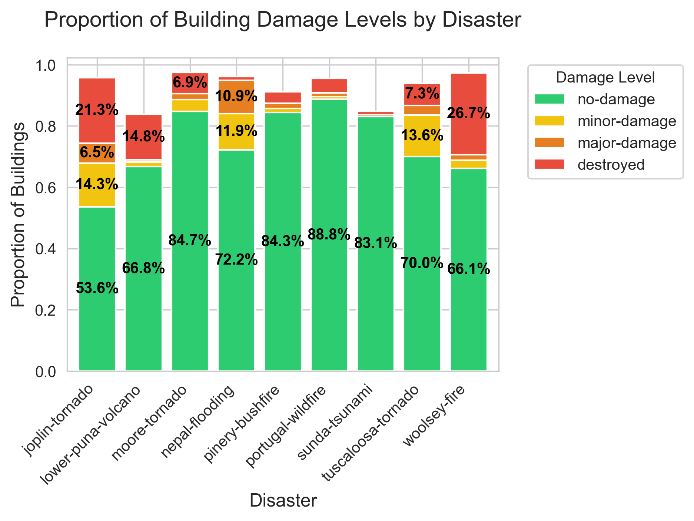

# AI Disaster Relief: Building Damage Assessment System

This project implements a deep learning-based system for assessing building damage from satellite imagery, with a focus on disaster response and relief efforts. The system uses a custom ResNet-based architecture to classify building damage into four categories: no-damage, minor-damage, major-damage, and destroyed.

## Project Structure

```
AI_Disaster_Relief/
├── data/                    # Data directory
│   ├── raw/                # Raw satellite imagery and labels
│   │   ├── tier3/         # xView2 dataset
│   │   │   ├── images/     # Training images
│   │   │   ├── labels/    # Training labels
│   │   └── sample/        # Sample data for quick testing
│   └── processed/          # Processed and preprocessed data
├── notebooks/              # Jupyter notebooks
│   └── training/          # Training notebooks (including 50-epoch A100 training)
├── src/                    # Source code
│   ├── models/            # Model architectures
│   ├── preprocessing/     # Data preprocessing scripts
│   └── visualization/     # Visualization utilities
├── test/                  # Test scripts and evaluation
├── checkpoints/           # Model checkpoints
├── output/               # Output directory for predictions and visualizations
├── static/               # Static files for the web interface
├── requirements.txt      # Python dependencies
└── .env                  # Environment variables
```

## Dataset

This project uses the xView2 dataset, which is available at [xView2.org](https://xview2.org/). The dataset consists of high-resolution satellite imagery of buildings before and after various natural disasters.

### Dataset Download and Setup

1. Visit [xView2.org](https://xview2.org/) and register to access the dataset
2. Download the following components:
   - Training data (tier3) (~18GB)
3. Organize the downloaded data in the following structure:

```
data/raw/tier3/
├── train/
│   ├── images/           # Pre- and post-disaster images
│   └── labels/          # JSON annotation files
└──  test/
    ├── images/
    └── labels/
```

The dataset includes:

- High-resolution satellite imagery (0.3m resolution)
- Building-level annotations
- Damage classification labels
- Geographic metadata

### Dataset Distribution

The distribution of damage classes in our dataset is shown below:



This visualization shows the class imbalance in the dataset, with a majority of buildings being undamaged, followed by major damage, minor damage, and destroyed buildings. This imbalance is reflected in our model's performance metrics.

## Model Architecture

The system uses an improved ResNet-based architecture (`ImprovedDamageClassifier`) with the following key features:

- Base ResNet50 backbone (pretrained on ImageNet)
- Custom fully connected layers with batch normalization
- Dropout for regularization
- Four-class classification output (no-damage, minor-damage, major-damage, destroyed)

Key architectural components:

- Input: 224x224 RGB images
- Feature extraction: ResNet50 (up to final average pooling)
- Classification head:
  - FC1: 2048 → 1024 (with BatchNorm and ReLU)
  - Dropout (0.5)
  - FC2: 1024 → 512 (with BatchNorm and ReLU)
  - Dropout (0.5)
  - FC3: 512 → 4 (output classes)

## Setup and Installation

1. Clone the repository:

```bash
git clone https://github.com/yourusername/AI_Disaster_Relief.git
cd AI_Disaster_Relief
```

2. Create and activate a conda environment:

```bash
conda create -n disaster_relief python=3.11
conda activate disaster_relief
```

3. Install dependencies:

```bash
pip install -r requirements.txt
```

4. Set up environment variables:
   Create a `.env` file in the root directory with the following content:

```
TESSADEM_API_KEY= API key
TESSADEM_BASE_URL="https://tessadem.com/api/elevation"
OVERPASS_URL="http://overpass-api.de/api/interpreter"
```

## Training the Model

The model can be trained using the notebook in `notebooks/training/`. The training was performed on Google Colab using an A100 GPU for 50 epochs (~9h). Key training parameters:

- Optimizer: Adam
- Learning Rate: 0.001
- Batch Size: 100
- Loss Function: Cross Entropy Loss
- Data Augmentation: Random horizontal flips, rotations, and color jittering

## Testing the Model

To test the model on a subset of non-trained data:

```bash
python test/test_model.py
```

This will:

1. Load the trained model from checkpoints
2. Process test images
3. Generate predictions
4. Create visualizations in the output directory
5. Generate performance metrics and confusion matrix

## Launching the Streamlit App

To launch the web interface:

```bash
streamlit run src/dashboard/app.py
```

The app provides:

- Interactive map interface for selecting disaster areas
- Real-time building damage assessment
- Visualization of damage classifications
- Export capabilities for damage reports

## Performance Metrics

The model achieves the following performance metrics on the test set:

### Class-Specific Performance

| Class            | Precision | Recall | F1-Score | Support |
| ---------------- | --------- | ------ | -------- | ------- |
| No-damage (0)    | 0.8572    | 0.8666 | 0.8619   | 4799    |
| Minor-damage (1) | 0.2606    | 0.2186 | 0.2378   | 590     |
| Major-damage (2) | 0.6589    | 0.6877 | 0.6730   | 1963    |
| Destroyed (3)    | 0.3088    | 0.1875 | 0.2333   | 112     |

### Overall Performance

| Metric           | Value  |
| ---------------- | ------ |
| Accuracy         | 0.7582 |
| Macro Average    | 0.5015 |
| Weighted Average | 0.7534 |

The model shows strong performance in identifying undamaged buildings (F1-score: 0.8619) and major damage (F1-score: 0.6730), while facing challenges with minor damage and destroyed buildings, likely due to class imbalance in the dataset.

The distribution of damage classes in the dataset can be visualized in `output/damage_proportions.png`.

## Sources and References

- Xview2 paper: https://arxiv.org/pdf/1911.09296
- Xview2 website: https://xview2.org/
- Kaggle notebook by Lezwon Castellino · 5y ago · 9,096 views https://www.kaggle.com/code/lezwon/xview2-challenge
- Kaggle notebook by BHUVAN N M · 1y ago · 830 views https://www.kaggle.com/code/bhuvannm/xbd-preprocessing

## Contributing

Yan Bernard - xdyanou
Armand Hubler - the_ahub
Marco Celati
Sarah-Ghislaine Coste
Jean Carlos

## License

This project is licensed under the MIT License for educational purposes. This means you are free to:

- Use the code for educational and research purposes
- Modify and adapt the code
- Distribute the code
- Use the code for non-commercial purposes

The only requirements are:

- Include the original copyright notice
- Include the license text
- State any significant changes made to the code

## Acknowledgments

We would like to express our sincere gratitude to Professor Rubén Sánchez García for his guidance, support, and the opportunity to work on this meaningful project.

This project was developed by:

- Yan Bernard (xdyanou)
- Armand Hubler (the_ahub)
- Marco Celati
- Sarah-Ghislaine Coste
- Jean Carlos

We also acknowledge the xView2 challenge organizers and dataset providers for making this valuable resource available to the research community.
